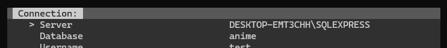
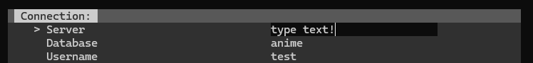
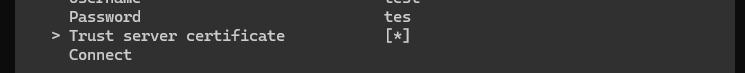
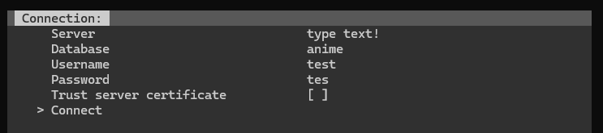
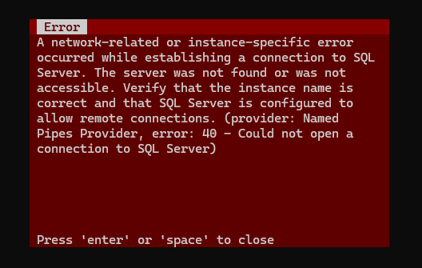
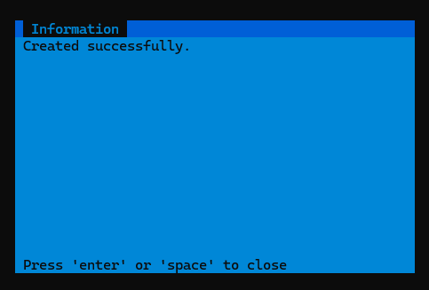
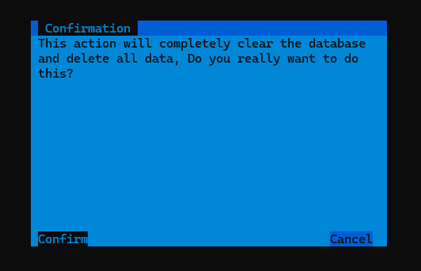

# AnimeDB

AnimeDB is a console-based application for managing an anime database. 
It allows users to connect to a database, manage anime-related data, and perform various operations such as creating, renaming, and deleting entries.

## Features

- Connect to an SQL database with configurable credentials.
- Create and manage users, genres, anime, movie episodes, and watchlist entries.
- Import and export user data.
- Delete anime entries from the database.
- Rename users in the database.
- Reset the database (WARNING: This will delete all data).
- Simple text-based menu navigation.

## Requirements

> Note: Mostly only valid if you choose to run with visual studio instead of the [latest release](https://github.com/VerumHades/AnimeDB/releases/latest/download/release.zip)

- .NET SDK (latest version recommended)
- SQL Database instance for data storage
- Required NuGet packages:
	- `Microsoft.Data.SqlClient`
	- `System.Configuration.ConfigurationManager`

## Getting Started

### The Easy Way

1. Download the [latest release](https://github.com/VerumHades/AnimeDB/releases/latest/download/release.zip)
2. Extract the zip archive
3. Find and run `AnimeDB.exe`

### The Visual Studio Way
1. **Clone the repository:**
   ```sh
   https://github.com/VerumHades/AnimeDB.git
   cd AnimeDB
   ```
    
2. **Open the project in Visual Studio**  
Open the project in visual studio by clicking the AnimeDB.sln file

3. **Install NuGet packages if missing**  
These two required NuGet packages might be missing so you will need to install them manualy:
- `Microsoft.Data.SqlClient`
- `System.Configuration.ConfigurationManager`

3. **Run the application:**  
Press the run button in visual studio

## Usage


### Your first connection

> Warning: When writing time you need to stick to a format `dd-MM-yyyy HH:mm:ss`

You may navigate using the `w`, `arrow_up` and `s`, `arrow_down` keys to select options.

> Options preceded by `>` are selected

You can edit a text field by hitting `enter`, most of these usually have text behind them but they might not so dont get confused.  
  
Confirm by pressing `enter` again.
> Note: If you want to keep the previous contents just write nothing and press `enter` this will keep the original contents before you edited

You can toggle fields followed by [ ] on and off by pressing `enter` or `space`, look:  
   
And off  
  

And finally to buttons that can just be activated, these are mainly used to navigate menus but here you also use them to connect activate by pressing `enter`:


Oh and if anything fails you get error messages:  
  
Or if something goes right you get informational messages:  
 

Oh yeah and there is at least on of these confirmation menus, press `arrow_left` or `arrow_right` to select an option and `enter` to confirm it!  
 

> Note: You might need to resize the window if you cannot see everything or the UI is looking weird 

> Warning: Connecting may take 5 seconds, the freeze when trying to connect, so just wait   
> Tip: Ticking the `Trust server certificate` might fix your connection issue, otherwise check your credentials

### Available Actions:
- **Create**: Users, genres, anime, movie episodes, watchlist entries
- **Export/Import**: User data to/from a file
- **Delete**: Remove an anime entry
- **Rename**: Change a username
- **Reset**: Erase all database contents (use with caution)

## Notes

- If the database connection fails, the application will return to the connection menu.
- The database connection timeout is set to **5 seconds**.
- Trusting the server certificate may be required for some connections.